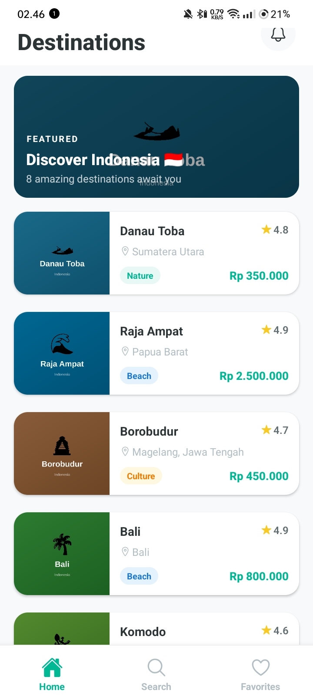
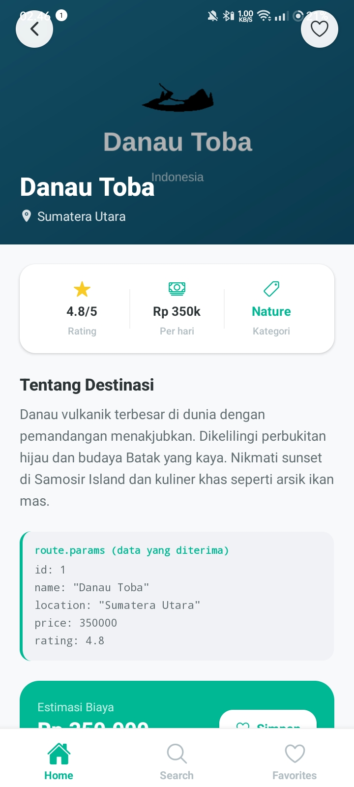
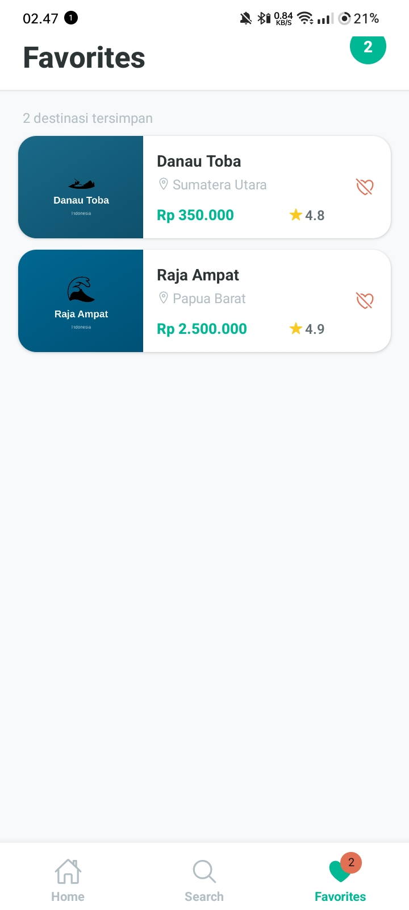

# Travel Buddy

Multi-screen React Native app dengan React Navigation — dibuat untuk Pertemuan 9 Praktikum Mobile Programming.

---

## Screenshots

| Home Screen | Detail Screen | Favorites Screen |
|:-----------:|:-------------:|:----------------:|
|  |  |  |

---

## Features

- **Bottom Tab Navigation** — 3 tabs: Home, Search, Favorites
- **Stack Navigator** di Home Tab (HomeScreen → DetailScreen)
- **Route params** untuk pass destination data ke DetailScreen
- **FlatList** dengan 8 destinasi wisata Indonesia
- **@expo/vector-icons (Ionicons)** untuk semua tab icons
- **Add to Favorites** — simpan & hapus favorit via Context API *(BONUS)*
- **Search + Category Filter** — filter destinasi by nama/lokasi/kategori *(BONUS)*
- **Favorites badge count** di tab bar *(BONUS)*
- **Responsive layout** — SafeAreaView + useSafeAreaInsets untuk notch & navigation bar

---

## Tech Stack

| Library | Versi | Fungsi |
|---|---|---|
| React Native + Expo | ~51.0.0 | Framework utama |
| React Navigation 6 | ^6.x | Navigasi multi-screen |
| @react-navigation/bottom-tabs | ^6.5.20 | Bottom Tab Navigator |
| @react-navigation/native-stack | ^6.9.26 | Stack Navigator |
| react-native-safe-area-context | 4.10.5 | Safe area handling |
| react-native-screens | ~3.31.1 | Native screen optimization |
| @expo/vector-icons | ^14.0.2 | Tab & UI icons (Ionicons) |
| @react-native-async-storage/async-storage | 1.23.1 | Storage (siap dipakai) |

---

## Struktur Navigasi

```
NavigationContainer
└── TabNavigator (Bottom Tabs)
    ├── HomeTab → HomeStackNavigator
    │   ├── HomeScreen        (FlatList destinations)
    │   └── DetailScreen      (route.params display)
    ├── SearchTab → SearchScreen   (search + filter)
    └── FavoritesTab → FavoritesScreen (saved destinations)
```

---

## Struktur Folder

```
TravelBuddy/
├── App.js                        # Entry point, NavigationContainer
├── app.json
├── index.js
├── package.json
├── assets/
│   ├── home-screen.png           # Screenshot HomeScreen
│   ├── detail-screen.png         # Screenshot DetailScreen
│   └── favorites-screen.png      # Screenshot FavoritesScreen
└── src/
    ├── context/
    │   └── FavoritesContext.js   # Global state favorites
    ├── data/
    │   └── destinations.js       # 8 destinations data
    ├── navigation/
    │   ├── TabNavigator.js       # Bottom Tab Navigator
    │   └── HomeStackNavigator.js # Stack Navigator (Home tab)
    └── screens/
        ├── HomeScreen.js         # FlatList destinations
        ├── DetailScreen.js       # Detail + route.params
        ├── SearchScreen.js       # Search + filter (BONUS)
        └── FavoritesScreen.js    # Saved favorites (BONUS)
```

---

## How to Run

```bash
# 1. Clone repo
git clone https://github.com/[USERNAME]/TravelBuddy.git
cd TravelBuddy

# 2. Install dependencies
npm install

# 3. Start Expo
npx expo start

# 4. Scan QR code di Expo Go (iOS/Android)
```

---

## Navigation Flow

1. **HomeScreen** — tampil FlatList 8 destinasi dengan card UI
2. Tap card → `navigation.navigate('Detail', { destination: item })` → **DetailScreen**
3. DetailScreen extract data via `route.params.destination`
4. Tap ❤️ Simpan → destination masuk ke FavoritesContext (global state)
5. Tap Back / hardware back → `navigation.goBack()` → kembali ke HomeScreen
6. **SearchTab** — real-time filter by nama, lokasi, kategori
7. **FavoritesTab** — tampil semua tersimpan dengan badge count di tab bar

---

## Author

Eykel Agitha Kembaren
Universitas Prima Indonesia (UNPRI)  
Sistem Informasi — Praktikum Pemrograman Mobile(React Native)  
Pertemuan 9
